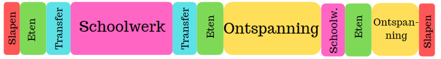
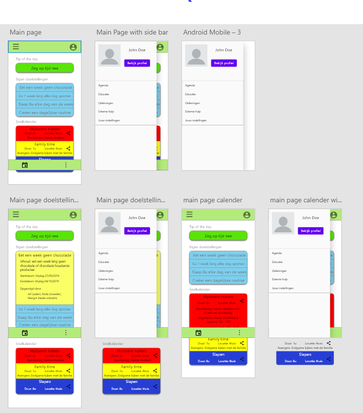

# Analyse

## Opdracht
We willen een Applicatie ontwikkelen voor jongeren die hun toe staat om een goed evenwicht te vinden tussen school, ontspanning, slaap en andere activiteiten. Deze applicatie zal ervoor zorgen dat de jongeren de mogelijkheid hebben om na te gaan wat ze doen in het dageijkse leven en helpt hun de ideale balans te vinden.

## Project Beschrijving
Het project dat we hebben gekozen is een applicatie met als doel jongeren tussen 12 en 18 te helpen om hun ideale life balans te vinden. Deze applicatie zal de gebruiker hoofdzakelijk toestaan om een agenda op te stellen voor hun dagelijkse activiteiten en deze naar wens aan te passen en te personaliseren op de manier die hij/zij zelf wilt. Door de mogelijkheid van personalisatie toe te voegen kan de gebruiker de agenda echt van zichzelf maken waardoor het een fijnere gebruikerservaring zal meegeven. Bij deze applicatie zal ook nog die optie zijn om mindfulness oefeningen en happiness oefeningen uit te voeren. 
Mindfulness oefeningen dienen om de gebruiker te trainen om zich meer op de hoogte te houden van het huidige moment waar hij/zij zich in bevindt terwijl de happiness oefeningen meer dienen om de gebruiker te trainen om meer geluk te vinden op elk moment van de dag. 
De applicatie zal ook de mogelijkheid geven om de gebruiker zijn doelstellingen te tracken en hierbij notities toe te voegen. Hierdoor kan de gebruiker zich altijd focussen op de dingen die hij/zij wilt bereiken binnen een bepaalde tijdspanne en kan hij eventueel altijd vooruitgang noteren bij deze doelen. Om de gebruiker hiervoor nog extra gemotiveerd te houden zal hij beloningen krijgen bij het bereiken van deze doelen. 
Tenslotte willen we hierbij nog toegang bieden tot verschillende externe hulpdiensten door deze diensten hun contact gegevens ten alle tijden beschikbaar te maken via onze applicatie. Dit project zal helemaal geschreven worden in Ionic zodat we een PWA kunnen maken die zowel op Android als op IoS zal werken.

## Screen per Screen

### Main Menu
De main menu willen we samenstellen uit 3 componenten :

* De tip van de dag : een tip of een quote die iedere dag zal veranderen. Elke dag zal men een nieuwe tip van de dag uit een firebase krijgen.

* Agenda : een klein overzicht van wat de gebruiker vandaag heeft gedaan/nog gaat doen.

* Doelstellingen : elke doelstelling laat zich 1 voor 1 zien als reminder aan de gebruiker zijn doelen.

Elk van deze componenten zal clickable zijn en de gebruiker brengen naar deze component, als men dus bijvoorbeeld op de agenda component drukt zal men de gehele agenda zien.

### Agenda
De agenda zal de mogelijkheid geven aan de gebruiker om alle dagelijkse activiteiten te tracken. Elke toevoeging aan de agenda zal volledig personaliseerbaar zijn in kleur en look. De gebruiker zal hierbij kunnen tracken wat hij elke dag doet en zal ook een mooi overzicht krijgen van welke activiteiten de meeste tijd op zich nemen en welke de minste tijd nemen. Dit overzicht zal worden gerepresenteerd als een pie chart. Deze agenda zal kunnen gesychroniseerd worden of zal grotendeels een geintegreerde Google agenda zijn omdat deze al helemaal customizable is.

    

### Doelstellingen
De doelstellingen pagina zal de gebruiker de mogelijkheid geven om zijn/haar doelen voor een bepaalde dag of in het algemeen op te slaan hierbij notities te zetten over bijvoorbeeld vooruitgang bij dit doel of andere eventuele opmerkingen. Dit zal ook allemaal opgeslagen worden in een database. 

   
      
         
           
### Profiel
Hier staat algemene informatie over de gebruiker. Dit zal dus de naam, leeftijd en andere info zijn met eventueel een foto van de gebruiker zelf. Hier zal ook de mogelijkheid gegeven worden om je wachtwoord aan te passen.

### Oefeningen
Deze pagina zal simpelweg toegang geven naar de mindfulness en happiness oefeningen die ter beschikking staan in de applicatie. Dit kan simpelweg via 2 knoppen die de keuze aanbieden. Deze oefeningen zullen ook weer uit een database komen zodat men later op elk moment nog oefeningen kan toevoegen aan de lijst. Oefeningen kunnen altijd aangepast worden of toegevoegd/verwijdert worden door de hosts van de database indien er nood is aan meer oefeningen of als een oefening niet in orde is.

### Instellingen
De instellingen pagina zorgt ervoor dat de gebruiker de app kan personaliseren naar zijn wens. Dit houdt dan bijvoorbeeld in de kleuren van sommige delen en de algemene layout van de app. Op deze pagina gaat het ook mogelijk zijn om bijvoorbeeld zelf te kiezen welke reminders er mogen verschijnen en wanneer deze reminders moeten verschijnen zodat iedere gebruiker dit kan aanpassen naar zijn wens.

## MockUp

