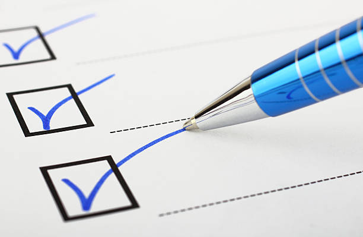

# Analyse

## Opdracht
Dit project gaat erom om een applicatie voor jongeren (tussen 12 en 18 jaar) te ontwikkelen die hen in staat stelt om een goed evenwicht te vinden tussen school, ontspanning, slaap en andere activiteiten. De applicatie zal hen de mogelijkheid geven om na te gaan wat ze allemaal doen in het dagelijkse leven en hen helpen de ideale balans te vinden.

## Project Beschrijving
Voor dit project zullen we een applicatie creëren die gericht is op jongeren tussen de 12 en 18 jaar oud. Het doel van deze applicatie is om hen te helpen met het vinden van hun ideale life balance. Dit wordt door de applicatie op een preventieve manier aangebracht bij deze jongeren door hen de toegang te bieden tot het gebruik van een agenda en andere zaken die hier essentieel in zijn. 
Zo zal er naast een personaliseerbare agenda ook toegang zijn tot mindfulness en happiness oefeningen die door de jongeren uit te voeren zijn.
De mindfulness oefeningen dien om de jongere te trainen om zich meer op de hoogte te houden van het huidige moment waarin hij/zij zich bevindt. Dit terwijl de happiness oefeningen eerder dienen om de jongere te trainen om zich gelukkiger te voelen op verschillende momenten doorheen de dag.
De applicatie zal personaliseerbaar zijn op verschillende vlakken door de jongere. De jongere kan in zijn agenda bijvoorbeeld niet alleen activiteiten toevoegen, maar deze ook categoriseren en een kleur geven. Persoonlijke doelstellingen kunnen worden toegevoegd worden door de jongere en deze zullen ook te tracken zijn. Er kunnen dan ook nog notities worden toegevoegd aan deze doelstellingen of ergens apart. Op deze manier kan de jongere zich focussen op het behalen van bepaalde doelstellingen, hierbij aantekeningen maken en reminders instellen om zichzelf eraan te doen herinneren.
Om de jongeren extra motivatie te geven omtrent de doelstellingen, zullen er ook beloningen worden gegeven bij het bereiken van deze doelen.
Er zal ook vanuit de app toegang worden geboden aan verschillende externe (hulp)diensten. Van deze diensten zullen contactgegevens ten alle tijden beschikbaar zijn via de applicatie.
De applicatie zal geschreven worden in Ionic, dit zodat er een PWA kan gemaakt worden die zowel op Android als Ios zal werken.

## Screen per Screen

### Main Menu
De main menu willen we samenstellen uit 3 componenten :

* De tip van de dag : een tip of een quote die iedere dag zal veranderen. Elke dag zal men een nieuwe tip van de dag uit een firebase krijgen.

* Agenda : een klein overzicht van wat de gebruiker vandaag heeft gedaan/nog gaat doen.

* Doelstellingen : elke doelstelling laat zich 1 voor 1 zien als reminder aan de gebruiker zijn doelen.

Elk van deze componenten zal clickable zijn en de gebruiker een kort detail tonen van datgene waar hij/zij op klikt. Indien de gebruiker dan nog eens klikt zal de applicatie de gebruiker doorsturen naar deze component, als men dus bijvoorbeeld op de agenda component drukt zal men de gehele agenda zien.

### Agenda
In de agenda zal de gebruiker de mogelijkheid hebben om alle dagelijkse activiteiten te tracken, editen en aan te maken. Elke toevoeging aan de agenda zal volledig personaliseerbaar zijn in kleur en look. Hierbij zal de gebruiker kunnen tracken wat hij elke dag doet en zal hem/haar ook een duidelijk overzicht verkrijgen waarop staat welke activiteiten het meeste en welke het minste tijd innemen. Dit overzicht zal gepresenteerd worden als een pie chart. De agenda zal gesynchroniseerd kunnen worden of zal grotendeels een geïntegreerde Google Agenda zijn omdat dit al ver te customizen is.

    

### Doelstellingen
De doelstellingen pagina zal de gebruiker de mogelijkheid geven om zijn/haar doelen voor een bepaalde dag of in het algemeen op te slaan hierbij notities te zetten over bijvoorbeeld vooruitgang bij dit doel of andere eventuele opmerkingen. Dit zal ook allemaal opgeslagen worden in een database. 

   

### Profiel
Hier zal de algemene informatie van de gebruiker te vinden zijn. Dit zal dus de naam, leeftijd en andere info zijn met eventueel een foto van de gebruiker zelf. De mogelijkheid om het wachtwoord aan te passen zal ook op deze pagina te vinden zijn.

### Oefeningen
Deze pagina zal simpelweg toegang geven naar de mindfulness en happiness oefeningen die ter beschikking staan in de applicatie. Dit kan simpelweg via 2 knoppen die de keuze aanbieden. Deze oefeningen zullen ook weer uit een database komen zodat men later op elk moment nog oefeningen kan toevoegen aan de lijst. Oefeningen kunnen altijd aangepast worden of toegevoegd/verwijdert worden door de hosts van de database indien er nood is aan meer oefeningen of als een oefening niet in orde is.

### Instellingen
De instellingen pagina zorgt ervoor dat de gebruiker de app kan personaliseren naar zijn wens. Dit houdt dan bijvoorbeeld in de kleuren van sommige delen en de algemene layout van de app. Op deze pagina gaat het ook mogelijk zijn om bijvoorbeeld zelf te kiezen welke reminders er mogen verschijnen en wanneer deze reminders moeten verschijnen zodat iedere gebruiker dit kan aanpassen naar zijn wens.

## MockUp

